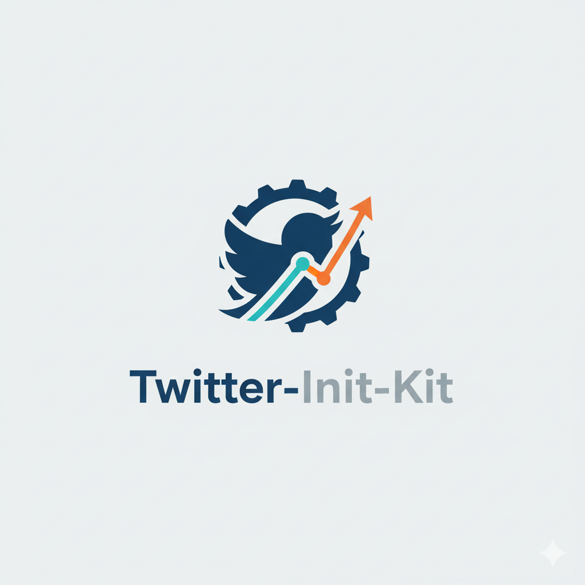

<div align="center">
    
    <h1>🐦 Twitter-Init-Kit</h1>
    <h3><em>Launch your AI product on Twitter with spec-driven marketing workflows.</em></h3>
</div>

<p align="center">
    <strong>A spec-driven toolkit for systematic Twitter marketing of AI SaaS products, built on the foundations of spec-kit.</strong>
</p>

<p align="center">
    <a href="https://github.com/agentii-ai/twitter-init-kit/actions"></a>
    <a href="https://github.com/agentii-ai/twitter-init-kit/stargazers"></a>
    <a href="https://github.com/agentii-ai/twitter-init-kit/blob/main/LICENSE"></a>
    <a href="https://kits.agentii.ai"></a>
</p>

---

## 🐦 What is Twitter-Init-Kit?

**Twitter-Init-Kit** is a specialized variant of [**Spec-Kit**](https://github.com/github/spec-kit), adapted for Twitter marketing and launch campaigns for AI SaaS products.

While Spec-Kit enables spec-driven software development with AI agents, **Twitter-Init-Kit applies the same methodology to the domain of Twitter marketing, founder-led growth, and demo-driven launches**—helping founders and growth leads execute systematic Twitter campaigns instead of ad-hoc social media experimentation.

### Key Differences from Spec-Kit

| Aspect | Spec-Kit | Twitter-Init-Kit |
|--------|----------|------------------|
| **Focus** | Software feature development | Twitter marketing campaigns |
| **Primary Workflow** | Specification → Plan → Code → Test | Specification → Plan → Content → Launch |
| **Success Metrics** | Code quality, test coverage, performance | Engagement, activation, retention, virality |
| **Deliverables** | Production software & APIs | Campaign specs, content calendars, growth loops |
| **CLI Command** | `specify` | `twitterify` |
| **Agent Commands** | `/speckit.*` | `/twitterkit.*` |

---

## 🚀 Get Started

### 1. Install Twitter-Init-Kit

Choose your preferred installation method:

#### Option 1: One-Time Usage (Recommended)

Run directly without installing—always uses the latest version:

```bash
uvx --from git+https://github.com/agentii-ai/twitter-init-kit.git twitterify init my-campaign
uvx --from git+https://github.com/agentii-ai/twitter-init-kit.git twitterify check
```

> **Note**: This project is improving rapidly. We recommend `uvx` to always get the latest features and fixes.

#### Option 2: Persistent Installation

Install once and use everywhere (may require periodic updates):

```bash
uv tool install twitterify-cli --from git+https://github.com/agentii-ai/twitter-init-kit.git
```

Then use the tool directly:

```bash
twitterify init my-campaign
twitterify check
```

To update to the latest version:

```bash
uv tool install twitterify-cli --force --from git+https://github.com/agentii-ai/twitter-init-kit.git
```

### 2. Initialize Your First Twitter Campaign

```bash
twitterify init my-ai-product-launch
cd my-ai-product-launch
```

This creates a project with Twitter-specific templates, constitution, and agent commands.

### 3. Launch Your AI Agent

Open your AI assistant (Claude Code, Cursor, Windsurf, etc.) in the project directory. You'll see `/twitterkit.*` commands available:

```bash
/twitterkit.constitution    # Establish Twitter marketing principles
/twitterkit.specify         # Define campaign objectives and strategy
/twitterkit.clarify         # Resolve ambiguities in your campaign plan
/twitterkit.plan            # Create execution plan with growth loops
/twitterkit.tasks           # Generate actionable marketing tasks
/twitterkit.implement       # Execute Twitter campaign workflow
```

### 4. Run Your First Twitter Campaign Workflow

```bash
/twitterkit.specify Launch a 4-week Twitter campaign for AI-powered code review tool targeting senior engineers at Series A-C startups
```

This generates a Twitter campaign specification with:
- Sharp personas (technical founders, growth leads, target audience)
- Campaign objectives and channel strategies
- Hero workflows mapped to Twitter content
- Growth loops (demo-to-inbound, artifact loop, template loop)
- Success metrics (engagement, activation, retention, virality)

---

## 🤖 Supported AI Agents

Twitter-Init-Kit works with all agents supported by Spec-Kit:

| Agent | Support | Notes |
|-------|---------|-------|
| [Claude Code](https://www.anthropic.com/claude-code) | ✅ | Native support |
| [Cursor](https://cursor.sh/) | ✅ | Full integration |
| [Windsurf](https://windsurf.com/) | ✅ | Complete support |
| [Gemini CLI](https://github.com/google-gemini/gemini-cli) | ✅ | Verified working |
| [GitHub Copilot](https://github.com/features/copilot) | ✅ | Compatible |
| [Qoder CLI](https://qoder.com/cli) | ✅ | Supported |
| Plus 5+ additional agents | ✅ | See Spec-Kit docs |

---

## 📦 Twitter-Init-Kit Templates

Twitter-Init-Kit provides project templates for 18 AI coding agents, automatically downloaded when you run `twitterify init`. Each template includes:

- **Twitter-Kit Constitution v1.0.0** with Twitter marketing principles
- **Workflow templates**: spec.md, plan.md, tasks.md for campaign documentation
- **9 slash commands**: /twitterkit.specify, /twitterkit.plan, /twitterkit.tasks, /twitterkit.implement, /twitterkit.clarify, /twitterkit.analyze, /twitterkit.checklist, /twitterkit.taskstoissues, /twitterkit.constitution
- **Scripts**: Bash or PowerShell variants for automation
- **Memory system**: constitution.md for project-specific principles

### Supported Template Agents

Templates are available for all 18 agents in both bash and PowerShell variants (36 total):

- Claude Code • Cursor Agent • Windsurf • Google Gemini
- GitHub Copilot • Qoder • Qwen • OpenCode
- Codex • KiloCode • Auggie • CodeBuddy
- AMP • Shai • Amazon Q • Bob • Roo

See [GitHub Releases](https://github.com/agentii-ai/twitter-init-kit/releases) for downloadable template archives with SHA-256 checksums.

---

## 🐦 Core Twitter Workflow

### Phase 1: Specification (`/twitterkit.specify`)

Define **WHAT** you're launching and **WHO** you're targeting:
- Target personas (technical founders, growth leads, target audience)
- Campaign objectives and channel strategies
- Hero workflows mapped to Twitter content
- Success metrics (engagement, activation, retention)
- Constraints & risks
- Growth loop hypotheses

### Phase 2: Clarification (`/twitterkit.clarify`)

Resolve ambiguities before committing to execution:
- Validate persona sharpness
- Clarify campaign objectives
- Define success metrics precisely
- Identify unstated assumptions

### Phase 3: Planning (`/twitterkit.plan`)

Define **HOW** you'll execute the campaign:
- Twitter sprint cycle (2-week cadences)
- Phased launch plan (Stealth Alpha → Waitlist Beta → Public Launch)
- Growth loops (Demo-to-Inbound, Artifact, Template)
- Experiment log template
- Validation checkpoints & PDCA cycles

### Phase 4: Task Breakdown (`/twitterkit.tasks`)

Generate actionable marketing tasks:
- Phase 1: Setup & Foundation (profile, tooling, content bank)
- Phase 2: Stealth Alpha (outreach, growth engineering, content testing)
- Phase 3: Public Launch (launch day execution, post-launch momentum)
- Phase 4: Scale Machine (weekly recurring tasks, growth loop optimization)

### Phase 5: Execution (`/twitterkit.implement`)

Execute campaigns systematically with AI assistance:
- Create and schedule content
- Monitor engagement metrics
- Run growth experiments
- Document learnings & iterate

---

## 🌟 Twitter-Init-Kit Constitution

Twitter-Init-Kit is built on core principles that guide all marketing work:

### I. Specification-First Approach
Define campaign objectives and success criteria **before** creating content.

### II. Demo-Driven Growth
Support all marketing claims with product demos and real results—not hype.

### III. Iterative Validation
Follow 2-week sprint cycles with independent, testable experiments.

### IV. Minimal Viable Process
Use the simplest approach that achieves the marketing objective.

### V. Founder-Led Authenticity
Prioritize authentic founder voice over polished corporate marketing.

### VI. Kit Namespace Isolation
Enable multiple kit variants (`twitter-kit`, `pmf-kit`, `spec-kit`) to coexist without conflicts.

### VII. Template Extensibility
Serve as a reference implementation for creating domain-specific kit variants.

See [`.twitterkit/memory/constitution.md`](./.twitterkit/memory/constitution.md) for full details.

---

## 📚 Reference Documentation

Twitter-Init-Kit includes comprehensive reference materials to guide your campaigns:

- **`refs/0_overview.md`** - Overview of Twitter marketing for AI SaaS products
- **`refs/1_principles_for_constitution.md`** - Twitter-specific principles and patterns
- **`refs/2_define_for_specify.md`** - How to structure campaign specifications
- **`refs/3_project_management_for_plan.md`** - Campaign planning methodology
- **`refs/4_pm_tasking_for_tasks.md`** - Marketing task patterns
- **`refs/instructions.md`** - How to create your own kit variants

---

## 🔧 Multi-Kit Installation

Twitter-Init-Kit is designed to coexist with Spec-Kit and other kit variants:

```bash
# Install Spec-Kit for software development
uv tool install specify-cli --from git+https://github.com/github/spec-kit.git

# Install Twitter-Init-Kit for Twitter marketing
uv tool install twitterify-cli --from git+https://github.com/agentii-ai/twitter-init-kit.git

# Both tools work independently
specify check      # Shows Spec-Kit configuration
twitterify check   # Shows Twitter-Kit configuration

# Create projects with different kits
specify init my-feature              # Software feature project
twitterify init my-campaign          # Twitter campaign project
```

In your AI agent, both command namespaces are available:
- `/speckit.*` commands for software development workflows
- `/twitterkit.*` commands for Twitter marketing workflows

---

## 🎛️ CLI Reference

### `twitterify init` - Initialize Twitter Campaign

```bash
twitterify init <PROJECT_NAME>
twitterify init my-campaign --ai claude
twitterify init . --here --force        # Initialize in current directory
twitterify init my-campaign --ai cursor --script ps   # PowerShell scripts
```

**Options:**
- `--ai` - Specify AI assistant (claude, cursor, windsurf, gemini, etc.)
- `--script` - Script variant (sh for bash/zsh, ps for PowerShell)
- `--here` - Initialize in current directory
- `--force` - Skip confirmation when directory has files
- `--no-git` - Skip git initialization
- `--ignore-agent-tools` - Skip tool availability checks

### `twitterify check` - Verify Installation

```bash
twitterify check
```

Verifies Twitter-Init-Kit installation and checks for required tools (git, claude, cursor, windsurf, etc.).

---

## 🚀 Examples by AI Product Type

### Developer Tools (Cursor, Claude Code, Devin)

```
twitterify init ai-code-assistant-launch
/twitterkit.specify "Launch Twitter campaign for AI coding assistant targeting backend engineers at Series A startups"
```

Expected artifacts:
- Personas: Backend engineers, technical founders at 50-500 person SaaS
- Campaign objective: Build awareness and drive signups through demo content
- Hero workflow: Problem tweet → Demo video → Landing page → Waitlist
- Growth loop: Demo-to-Inbound (viewer → tries product → shares own demo)

### Creative Tools (Runway, Pika, HeyGen)

```
twitterify init video-generation-launch
/twitterkit.specify "Launch Twitter campaign for text-to-video tool targeting YouTube creators"
```

Expected artifacts:
- Personas: Content creators with 10k-100k subscribers
- Campaign objective: Showcase time savings through before/after demos
- Hero workflow: Pain point thread → Demo clip → Tutorial → User showcase
- Growth loop: Artifact loop (generated videos shared → new users → more artifacts)

### Vertical AI Tools (Harvey, Writer)

```
twitterify init contract-ai-launch
/twitterkit.specify "Launch Twitter campaign for AI legal analysis tool targeting solo practitioners"
```

---

## 📖 Learn More

- **[Twitter-Init-Kit Specification](./specs/000-twitter-init-kit-foundation/spec.md)** - Full feature specification
- **[Twitter-Init-Kit Implementation Plan](./specs/000-twitter-init-kit-foundation/plan.md)** - Technical implementation details
- **[Spec-Kit Repository](https://github.com/github/spec-kit)** - Upstream project for software development
- **[Spec-Driven Development Methodology](https://github.com/github/spec-kit/blob/main/spec-driven.md)** - Core methodology

---

## 🏗️ Project Structure

```
twitter-init-kit/
├── .claude/commands/          # Claude Code slash commands
│   ├── twitterkit.constitution.md
│   ├── twitterkit.specify.md
│   ├── twitterkit.plan.md
│   ├── twitterkit.tasks.md
│   ├── twitterkit.implement.md
│   ├── twitterkit.clarify.md
│   ├── twitterkit.analyze.md
│   └── twitterkit.checklist.md
├── .twitterkit/
│   ├── memory/
│   │   └── constitution.md        # Twitter-Kit principles (v1.0.0)
│   ├── templates/
│   │   ├── spec-template.md       # Campaign specification template
│   │   ├── plan-template.md       # Campaign planning template
│   │   ├── tasks-template.md      # Task breakdown template
│   │   ├── checklist-template.md  # Quality validation template
│   │   └── commands/              # Agent command templates
│   └── scripts/
│       ├── bash/                  # Bash automation scripts
│       └── powershell/            # PowerShell automation scripts
├── refs/                          # Reference documentation
│   ├── 0_overview.md
│   ├── 1_principles_for_constitution.md
│   ├── 2_define_for_specify.md
│   ├── 3_project_management_for_plan.md
│   ├── 4_pm_tasking_for_tasks.md
│   └── instructions.md            # How to create kit variants
└── specs/
    └── 000-twitter-init-kit-foundation/   # Feature specification & implementation docs
```

---

## 🔧 Prerequisites

- **Linux/macOS/Windows**
- [Supported](#-supported-ai-agents) AI coding agent
- [uv](https://docs.astral.sh/uv/) for package management
- [Python 3.11+](https://www.python.org/downloads/)
- [Git](https://git-scm.com/downloads)

### Verify Your Setup

Run `twitterify check` to verify all prerequisites and see which AI agents are available:

```bash
twitterify check
```

---

## 🌐 Creating Your Own Kit Variant

Twitter-Init-Kit demonstrates how to adapt spec-driven methodology to any domain. Want to create a variant for product design, PMF discovery, or business writing?

See [`refs/instructions.md`](./refs/instructions.md) for a comprehensive guide on:
- How to fork and adapt spec-kit for your domain
- How to define domain-specific principles
- How to create templates and reference materials
- How to enable multi-kit coexistence

**Example variants:**
- **`pmf-kit`** - Product-market-fit discovery
- **`pd-kit`** - Product design and UX workflows
- **`marketing-kit`** - Go-to-market and growth campaigns
- **`writing-kit`** - Technical and business writing

All variants are published at [**kits.agentii.ai**](https://kits.agentii.ai).

---

## 🙏 Acknowledgements

Twitter-Init-Kit is built on the excellent work of the [**Spec-Kit**](https://github.com/github/spec-kit) project from GitHub. We preserve 100% of Spec-Kit's architecture and infrastructure while adapting templates and methodology for Twitter marketing.

**Spec-Kit Credits:**
- [Den Delimarsky](https://github.com/localden)
- [John Lam](https://github.com/jflam)

---

## 💬 Support

For issues, questions, or feedback:

- **GitHub Issues**: [Report on Twitter-Init-Kit](https://github.com/agentii-ai/twitter-init-kit/issues)
- **Spec-Kit Issues**: [Report on Spec-Kit](https://github.com/github/spec-kit/issues)
- **Kit Variants**: [Visit kits.agentii.ai](https://kits.agentii.ai)

---

## 📄 License

This project is licensed under the terms of the MIT open source license. See [LICENSE](./LICENSE) for details.

**Note**: Twitter-Init-Kit extends Spec-Kit's MIT license. For Spec-Kit license details, see [Spec-Kit LICENSE](https://github.com/github/spec-kit/blob/main/LICENSE).

---

## 🌟 Why Twitter-Init-Kit?

### For Founders & Growth Leads:
- **Systematic**: Replace ad-hoc Twitter marketing with structured, spec-driven campaigns
- **AI-Assisted**: Leverage AI agents for specification, planning, and content creation
- **Evidence-Based**: Reference templates based on proven patterns from Cursor, Runway, HeyGen, and other successful AI launches
- **Demo-Driven**: Focus on showing, not telling—build credibility through product demos

### For the Open Source Community:
- **Reproducible**: Spec-driven workflows are more transparent and collaborative than ad-hoc processes
- **Extensible**: Twitter-Init-Kit serves as a reference for creating domain-specific kit variants
- **Community-Friendly**: All templates and reference materials are open source and MIT-licensed
- **Professional**: Built on proven Spec-Kit infrastructure

---

**Ready to launch your AI product on Twitter with confidence?**

```bash
twitterify init my-campaign
```

Let's build Twitter campaigns that drive real growth, with spec-driven precision.

---
